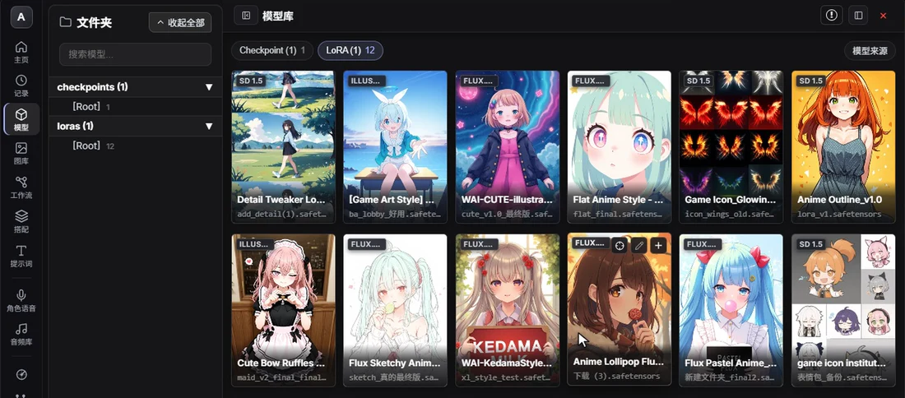
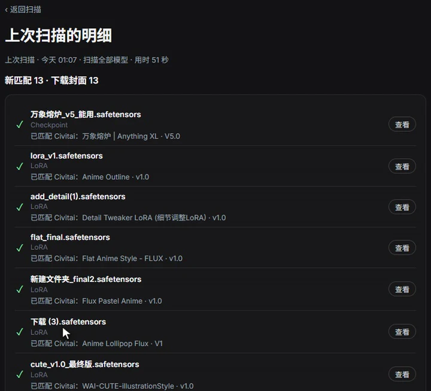
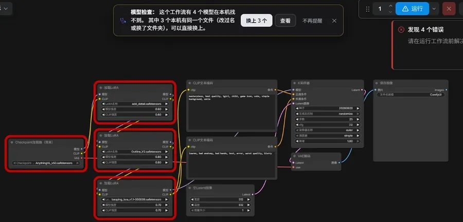
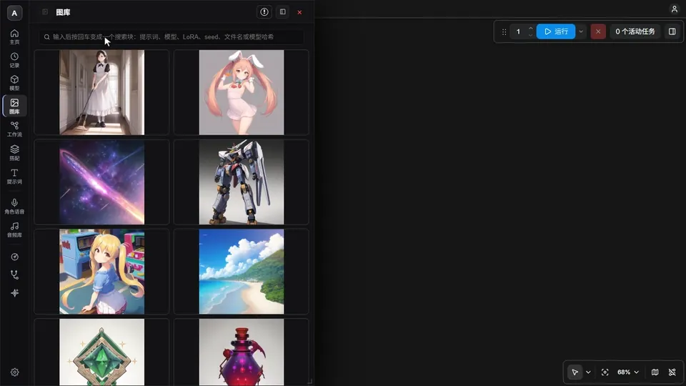
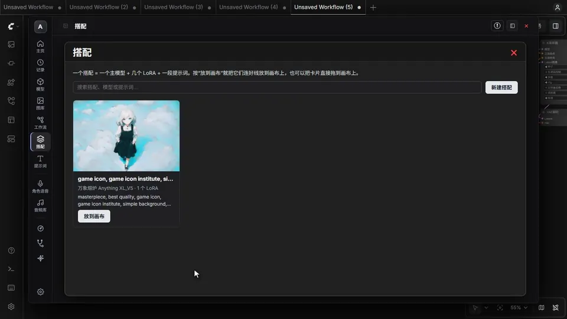
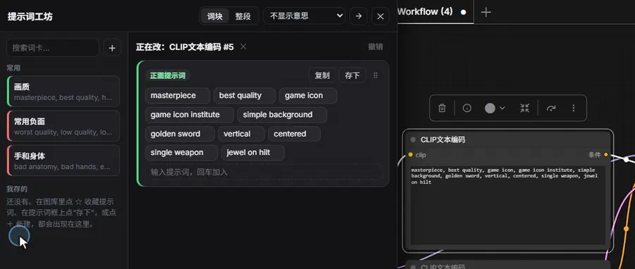
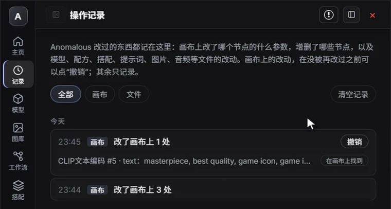
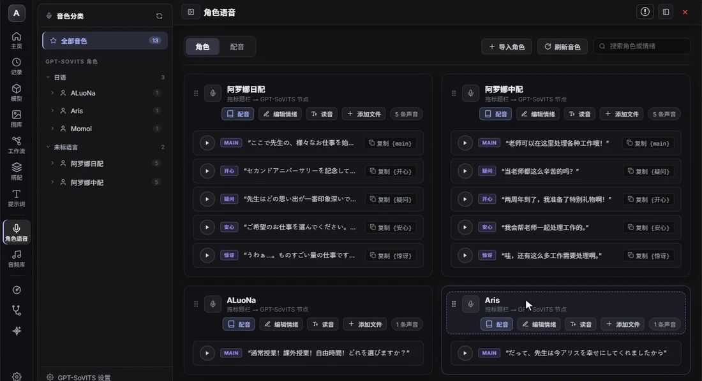

<div align="center">

# 🚀 Anomalous Model Browser

**A model browser and creative workspace for ComfyUI**  
*模型库 · 出图图库 · 工作流配方 · 搭配 · 提示词 · 角色配音 · 模型检查 · 操作记录*

<br/>

[](https://github.com/ltdrdata/ComfyUI-Manager)
[](LICENSE)
[](CHANGELOG.md)
[](https://www.bilibili.com/video/BV1a1bv68EuA/)
[](https://youtu.be/hAvsj7uiaCw)

<br/>

[**English**](#english) | [**中文说明**](#中文)

<br/>



</div>

---

<h2 id="english">🇬🇧 English</h2>

> **Anomalous Model Browser** takes care of the chores around ComfyUI in one window: browse your models with their Civitai covers and trigger words, look back through your outputs, keep workflows you have tuned, keep model combos and prompts, repair workflows whose models are missing, and, with the companion node pack [Anomalous_TTS](https://github.com/DemonGatanjieu/Anomalous_TTS), give your characters a voice. An activity log shows everything the plugin changed.

### 🎬 Video Walkthrough & Demos
* 📺 **YouTube**: [Watch Quick Walkthrough on YouTube](https://youtu.be/hAvsj7uiaCw)
* 📺 **Bilibili**: [Watch Video Demo on Bilibili (在哔哩哔哩观看)](https://www.bilibili.com/video/BV1a1bv68EuA/)

### 👀 See it in action

*The pictures show the Chinese interface; English is one switch away in Settings.*

**1. Scan once, then pick models by their covers.** Press **Scan** and every model is looked up on Civitai by its file hash, so even a file called `下载 (3).safetensors` gets its real name, cover, trigger words and base model.

<p align="center"></p>

**2. Open someone else's workflow without hunting for models.** When models are missing, a bar over the canvas says so. One press puts back the ones you already have under another name or in another folder; the red outlines go away.

<p align="center"></p>

**3. Find an old image and get its workflow back.** Search the gallery by prompt words, model or LoRA, then drag the image onto the canvas.

<p align="center"></p>

**4. Keep a model + LoRA + prompt combo and lay it down in one move.** Drag a combo card onto empty canvas: a wired group of nodes appears, and nothing already on the canvas changes.

<p align="center"></p>

**5. Edit prompts as tags.** Select a prompt node and Prompt Studio opens its text as tags: click to weight, drag to reorder, type to add (Chinese and other languages become English).

<p align="center"></p>

**6. See what the plugin changed, and undo it.** Every change the plugin makes is listed in Activity, with **Undo** and **Find on canvas**.

<p align="center"></p>

**7. Give characters a voice** (with [Anomalous_TTS](https://github.com/DemonGatanjieu/Anomalous_TTS)): GPT-SoVITS characters with a reference clip per emotion, and a script page to voice them.

<p align="center"></p>

### 🌟 What it does

Every page has an icon on the rail at the left of the window.

| Page | What you do there |
| :--- | :--- |
| **🏠 Home** | Pick what you want to do: a card per task, first steps (scan your model folders, a guided tour of the interface) and your latest activity. |
| **🕘 Activity** | Everything the plugin changed, by day: on the canvas (which node settings changed from what to what, nodes added or removed, workflows opened) and in files (models, covers, recipes, materials, notes, images, audio). **Find on canvas** jumps to the node; a canvas change can be undone with **Undo** until something changes it again, the rest is recorded only. Your own edits are not listed. |
| **📦 Models** | Your models with covers, trigger words and base model. Chips at the top switch between types (Checkpoint, LoRA, VAE…) and list a whole type, subfolders included; the folder list narrows it to one folder. **+** adds a loader node to the canvas; edit a model's name, notes and cover, or scan just that model. |
| **🖼️ Gallery** | Your ComfyUI `output` folder. Search by prompt, model, LoRA, seed, file name or model hash; open an image to see the parameters it was made with, or drag it onto the canvas to get its workflow back. **☆** keeps a good one as a whole workflow, a combo (model, LoRAs, prompt) or just its prompts. |
| **🪡 Workflows** | Workflow recipes: save a whole workflow or a part of one together with its models, cover, notes and parameters. Each card shows whether the models are on this computer; drag it onto the canvas to load it. Versions can be compared and restored. A card's export button makes a **recipe package** (.zip) to give to someone; dropped into their ⇅, it becomes a recipe card. |
| **🧩 Combos** | A main model, a few LoRAs and a prompt you like, kept together. **Put on canvas** (or dragging the card onto the canvas) lays them out as a wired group of nodes; nothing already on the canvas changes. |
| **✍️ Prompts** | Opens Prompt Studio beside the canvas. Select a prompt node and its prompt boxes appear as tags, edited in place: click a tag to make it stronger or weaker, double-click to edit, drag to reorder, type to add (Chinese, Japanese and other languages are translated to English), and show each tag's meaning in Chinese, Japanese, Korean and other languages. Click a card (a few common ones, plus your saved prompts) to add it, or drag it straight onto a prompt box on the canvas (outlined green for positive, red for negative) or onto empty canvas for a new prompt node. With no prompt node selected you write a draft. |
| **🎙️ Voices / 🎧 Audio** | With [Anomalous_TTS](https://github.com/DemonGatanjieu/Anomalous_TTS) installed: import GPT-SoVITS characters, pick a reference clip per emotion, fix pronunciations, write a script under Voice-over on the same page and generate it right there; generated audio is listed in the audio gallery. Without it, the page explains how to install it and nothing else depends on it. |

Tools on the rail:

* **Scan** reads your model folders and fetches covers, trigger words and base models from Civitai (by file hash, no extra Python packages).
* **Model Check** (formerly Model Doctor) checks each workflow you open: when models are missing, a bar over the canvas says so and puts back, with one press, the ones you have under another name or folder (recognised by hash and file size); its page lists the rest with what you can do.
* **Current node** (formerly Node Assistant) shows the model of the node you select, lets you swap it from the covers or insert a LoRA, and lists every set of values saved for that kind of node with exactly what applying it would change; saved values can be deleted there.
* **Each tool on its page**: share and import on Workflows (⇅: a short share code of the canvas workflow, in Chinese characters or letters; paste a code, or drop a workflow file, an image or a backup .zip), Model Sources (where each model can be downloaded) on Models and in Model Check, translation on the prompt boxes in Current node.
* **Settings** (at the bottom): language, font size, thumbnails, video covers, which model folders to show, and feedback. Home and Settings have **Report a problem**, which opens a GitHub issue with your versions and GPU already filled in.

**AI apps (MCP)**: Claude, Cursor, Cherry Studio and other apps that support MCP can use your library through `http://127.0.0.1:8188/anomalous/mcp`: answer questions about your models, outputs and saved prompts, and change the open workflow for you (prompts, models, LoRAs, combos, missing models), each change one Ctrl+Z step. Local only; setup in [docs/guides/mcp.md](docs/guides/mcp.md).

**Light on your computer**: the plugin itself loads no models, so it takes no graphics memory from image generation; the browser shows small thumbnails instead of full images, and its pictures are released a minute and a half after you close it. The voice models of Anomalous_TTS give their graphics memory back whenever ComfyUI needs it for image generation, and all of it on **Unload models**.

### 📦 Quick Installation

1. Open your terminal in the ComfyUI `custom_nodes` directory:
   ```bash
   cd custom_nodes
   git clone https://github.com/DemonGatanjieu/Anomalous_Model_Browser.git
   ```
2. Restart ComfyUI. *(Alternatively, install via **ComfyUI Manager** by searching for `Anomalous Model Browser`)*
3. For character voices, also install [Anomalous_TTS](https://github.com/DemonGatanjieu/Anomalous_TTS) the same way. It is optional.
4. **Updating**: click the **!** button at the top right of the browser; it shows the current version, and **Check for updates / switch version** opens the version panel. Update to the newest release, go back to an earlier one or return to the latest, then restart ComfyUI. The plugin never checks for updates on its own.

Open the browser with **Ctrl + Shift + M**, the floating button on the canvas, or **Extensions → Anomalous Model Browser** in ComfyUI's menu. **ComfyUI Settings → Anomalous Model Browser → Interface** changes the shortcut, the language and how the browser is opened (floating button, a button next to Run, or the Extensions menu only).

The first time you open it, start on **Home**: **Scan model folders** fills in covers and trigger words, and **Tour the interface** points at each part of the window.

> [!WARNING]
> **Keep a copy of your own data:** **Settings → Backup → Export** packs Workflow Recipes, combos, saved prompts and node values, parameter presets, and the names, notes and covers you gave your models into one .zip; keep it on a cloud drive or a USB stick, and **Import** puts it back, also on another computer. (They live in `workflows/anomalous_recipes`, `workflows/anomalous_notebooks`, `workflows/anomalous_materials` and `workflows/anomalous_parameters` in your ComfyUI user folder.)

---

<h2 id="中文">🇨🇳 中文说明</h2>

> **Anomalous Model Browser** 在一个窗口里帮你打理 ComfyUI 周边的杂事：
> - 带 C 站封面和触发词浏览模型；
> - 翻看以前的出图；
> - 保存调好的工作流，存下常用的模型搭配和提示词；
> - 别人的工作流缺模型时自动找回；
> - 配合配套节点包 [Anomalous_TTS](https://github.com/DemonGatanjieu/Anomalous_TTS) 给角色配音。
>
> 插件改动过什么，都能在“操作记录”里查到。

### 🎬 视频演示与教程
* 📺 **哔哩哔哩 (Bilibili)**：[在 B 站观看快速上手与使用演示](https://www.bilibili.com/video/BV1a1bv68EuA/)
* 📺 **YouTube**：[在 YouTube 观看视频演示](https://youtu.be/hAvsj7uiaCw)

### 👀 看图上手

**1. 扫描一次，以后看封面挑模型。** 点 **扫描**，每个模型都按文件哈希去 C 站认一遍。就算文件叫 `下载 (3).safetensors`，也能显示出它真正的名字、封面、触发词和底模。

<p align="center"></p>

**2. 打开别人的工作流，不用自己找模型。** 缺模型时画布上方会提示。你电脑里其实有、只是改了名或换了文件夹的，点一下就换上，红框随之消失。

<p align="center"></p>

**3. 找到以前的图，拿回当时的工作流。** 在图库里按提示词、模型或 LoRA 搜，再把图拖到画布上。

<p align="center"></p>

**4. 存下“模型 + LoRA + 提示词”的搭配，一拖就用。** 把搭配卡片拖到画布空白处，就放出一组连好线的节点，画布上原有的东西不动。

<p align="center"></p>

**5. 像搭积木一样改提示词。** 选中提示词节点，提示词工坊把它拆成词块：点一下调权重，拖动换位置，输入就加（中文会自动译成英文）。

<p align="center"></p>

**6. 插件改过什么都查得到，还能撤销。** 插件做的每一处改动都列在“操作记录”里，带 **撤销** 和 **在画布上找到**。

<p align="center"></p>

**7. 给角色配音**（需要 [Anomalous_TTS](https://github.com/DemonGatanjieu/Anomalous_TTS)）：导入 GPT-SoVITS 角色，每种情绪一段参考音频，在配音页写台词直接生成。

<p align="center"></p>

### 🌟 能做什么

窗口左侧的图标栏，每个页面一个图标。

| 页面 | 在这里做什么 |
| :--- | :--- |
| **🏠 主页** | 想做什么就点哪张卡片。还有上手第一步（扫描模型文件夹、界面导览）和最近的操作记录。 |
| **🕘 记录** | 按天列出插件做过的每一处改动。<br>画布上：哪个节点的设置从什么改成了什么、加了或删了哪些节点、打开了哪个工作流。<br>文件上：模型、封面、配方、素材、笔记、图片、音频。<br>**在画布上找到** 可以直接跳到那个节点；画布上的改动在没被再改过之前可以点 **撤销**，其余只记录。你自己在画布上的修改不会记进来。 |
| **📦 模型** | 模型带封面、触发词和底模信息。<br>顶部标签切换类型（Checkpoint、LoRA、VAE…），连同子文件夹一起列出；左侧文件夹列表可以只看某个文件夹。<br>**+** 一键在画布上创建加载节点；也可以改名、写备注、换封面，或只扫描这一个模型。 |
| **🖼️ 图库** | 读取 ComfyUI 的 `output` 文件夹。<br>可以按提示词、模型、LoRA、seed、文件名或模型哈希搜索。<br>点开图片能看到生成参数；拖到画布上可以还原当时的工作流。<br>觉得好就点 **☆**：存成整个工作流、搭配（模型 + LoRA + 提示词），或者只存提示词。 |
| **🪡 工作流** | 工作流配方：把完整工作流或其中一段，连同模型、封面、备注和参数一起存下来。<br>卡片会显示这台电脑上模型是否齐全；拖到画布上即可载入。<br>可以比较、恢复历史版本。<br>卡片上的导出按钮能打成**配方包**（压缩包）发给别人，对方拖进 ⇅ 就多一张配方卡片。 |
| **🧩 搭配** | 把常用的主模型、几个 LoRA 和一段提示词存成一个搭配。<br>按 **放到画布**（或把卡片拖到画布上），就放出一组连好线的节点；画布上原有的东西不动。 |
| **✍️ 提示词** | 在画布旁边打开提示词工坊。选中一个提示词节点，它的提示词框就以词块的样子出现在工坊里，直接改：点一下调权重，双击改字，拖动换位置，输入就加（中文、日文等会自动译成英文），还能在每个词下面显示它的中文、日文、韩文等语言的意思。<br>点词卡（几张常用的，加上你存的）加进去，或者直接拖到画布的提示词框里（正面绿框、负面红框），拖到空白处就新建一个提示词节点。没选中提示词节点时写的是草稿。 |
| **🎙️ 角色语音 / 🎧 音频库** | 装了 [Anomalous_TTS](https://github.com/DemonGatanjieu/Anomalous_TTS) 后可用：<br>导入 GPT-SoVITS 角色，给每种情绪选参考音频，修正读音；切到“配音”写台词并直接生成。<br>生成的音频都在音频库里。没装时，页面会说明怎么安装，其他功能不受影响。 |

图标栏上的工具：

* **扫描**：读取模型文件夹，按文件哈希从 C 站获取封面、触发词和底模。不需要额外安装 Python 包。
* **模型检查**（原“模型医生”）：打开工作流时自动检查，缺模型就在画布上方提示；本地改过名、换过文件夹的同一个文件（按哈希和文件大小认）一键换上，其余的在检查页里自己挑或去 Civitai 找。
* **当前节点**（原“节点助手”）：选中画布上的节点，查看它用的模型。可以看图换模型、插入 LoRA；存过的同类节点参数列在一起，每条写明会改哪几项，一键套用；存下的参数也在这里删除。
* **工具回到各自的页面**：分享与导入在“工作流”页（⇅：把画布上的工作流变成一段短短的分享码，有汉字码和字母码；也能粘贴分享码，或拖入工作流文件、图片、备份压缩包），模型来源（每个模型去哪下载）在“模型”页和模型检查里，翻译在“当前节点”的提示词框上。
* **设置**（最下面）：语言、字号、缩略图、视频封面、显示哪些模型文件夹，以及提交反馈。主页和设置里的 **报告问题** 会打开一个已经填好版本和显卡信息的 GitHub 页面。

**接入 AI 软件（MCP）**：Claude、Cursor、Cherry Studio 等支持 MCP 的 AI 软件，可以通过 `http://127.0.0.1:8188/anomalous/mcp` 查你的模型、出图和存下的提示词，回答相关问题；也能帮你改当前工作流（提示词、模型、LoRA、搭配、缺失的模型），每次改动都能用 Ctrl+Z 撤销。只限本机。设置方法见 [docs/guides/mcp.md](docs/guides/mcp.md)。

**不占你的资源**：
- 插件本身不加载任何模型，不和生图抢显存。
- 浏览时显示的是小缩略图，不加载原图；关闭窗口一分半后，图片也会释放掉。
- Anomalous_TTS 的语音模型在 ComfyUI 生图需要显存时会自动让出，点 **卸载模型** 时全部释放。

### 📦 快速安装

1. 在 ComfyUI 的 `custom_nodes` 目录下打开终端执行：
   ```bash
   cd custom_nodes
   git clone https://github.com/DemonGatanjieu/Anomalous_Model_Browser.git
   ```
2. 重启 ComfyUI 即可使用。（*也可以直接在 **ComfyUI Manager** 搜索 `Anomalous Model Browser` 安装*）
3. 想用角色配音的话，用同样的方法再装 [Anomalous_TTS](https://github.com/DemonGatanjieu/Anomalous_TTS)。不装也不影响其他功能。
4. **更新插件**：
   - 点窗口右上角的 **!**，可以看到当前版本；
   - 点 **检查更新 / 切换版本** 打开版本面板，可以更新到最新版、回退到以前的版本，或回到最新版；
   - 换完版本后重启 ComfyUI。插件不会自己联网检查更新。

打开方式有三种：按 **Ctrl + Shift + M**、点击画布上的悬浮按钮，或者从 ComfyUI 菜单 **扩展 → Anomalous Model Browser** 打开。在 **ComfyUI 设置 → Anomalous Model Browser → 界面** 里，可以修改快捷键、插件语言和打开方式（悬浮按钮、运行按钮旁的按钮，或只用扩展菜单）。

第一次打开时会停在 **主页**：点 **扫描模型文件夹** 补全封面和触发词；点 **界面导览** 会逐一指给你看窗口的各个部分。

> [!WARNING]
> **备份自己的数据：** **设置 → 备份 → 导出**，把工作流配方、搭配、存下的提示词和节点参数、参数预设，以及你给模型改的名字、备注和封面打成一个压缩包，放到云端硬盘或 U 盘里；换电脑或重装后用 **导入** 恢复。（它们存在 ComfyUI 用户目录下的 `workflows/anomalous_recipes`、`workflows/anomalous_notebooks`、`workflows/anomalous_materials` 与 `workflows/anomalous_parameters`。）

---

### 🧪 Tests (测试)

The plugin's tests are in `tests/`; run them all with `node tools/run_tests.mjs` from the plugin folder. See [docs/guides/testing.md](docs/guides/testing.md).
插件的测试在 `tests/` 里，在插件文件夹运行 `node tools/run_tests.mjs` 一次跑完。改代码或提 PR 之前跑一遍，说明见 [docs/guides/testing.md](docs/guides/testing.md)。

### 📝 License & Branding (开源与品牌声明)

* **Code License (代码授权)**: The source code is released under the [MIT License](LICENSE). 本项目源代码基于 MIT 许可证开源，可自由使用、修改与分发。
* **Branding & Trademarks (商标与品牌保护)**: The name **Anomalous Model Browser** and the official logo identify official releases. Forks should use distinct names/branding. 详见 [Trademark and Brand Policy](TRADEMARKS.md)。
